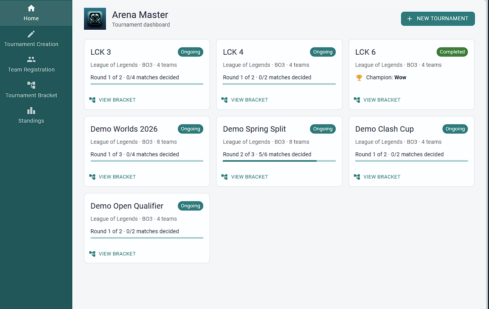
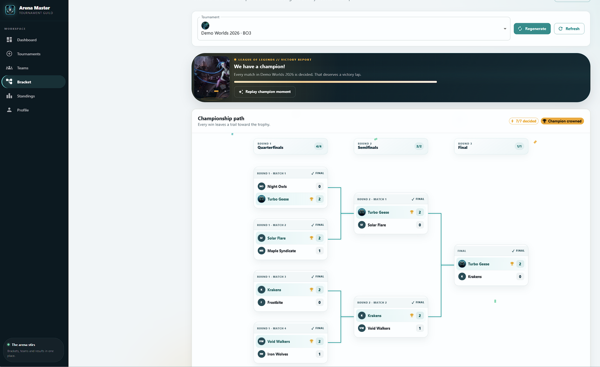
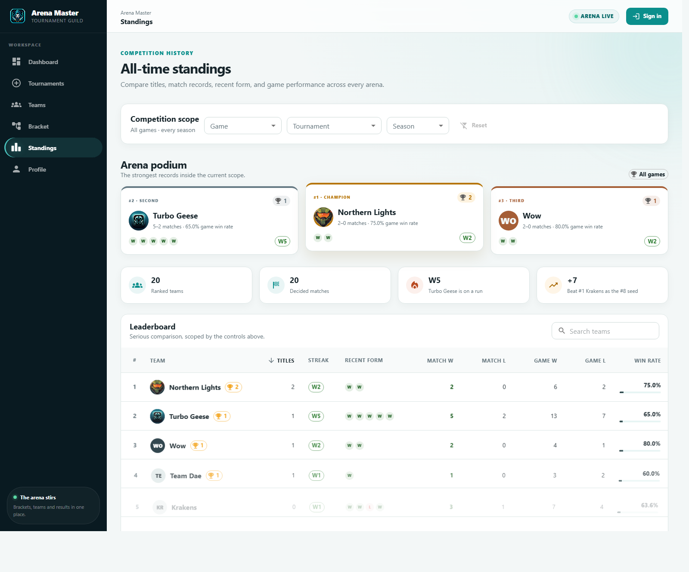

# Arena Master

**[arena.bortle.app](https://arena.bortle.app)** · a tournament platform for a Discord gaming community

Run single-elimination esports brackets end to end: create a tournament, register
teams, generate the draw, and record results as games finish. The bracket advances
itself, standings update, and Discord gets told about it — whether the result was
entered on the web or through the bot.

Sign in with Discord to organize. Anyone can watch without an account.



## Features

**Tournament dashboard** — every competition at a glance: status, round progress,
match completion and the champion once decided.

**Interactive bracket** — pannable, zoomable, rendered with
[@g-loot/react-tournament-brackets](https://github.com/g-loot/react-tournament-brackets).
Click a pending match to record a game; series scores update live, and completing a
round generates the next one automatically. Bo1/3/5/7, scored server-side.



**Discord sign-in and permissions** — OAuth login, with creation limited to members
of the community's Discord server. Tournaments belong to whoever created them; only
that person or an admin can generate the bracket, record results, or delete it.

**Discord announcements** — results are announced as they happen, in order, from the
backend — so the bot, the web UI and the API all produce the same notifications
rather than only the browser doing it.

**League of Legends profiles** — link a Riot ID to show rank and level on team
rosters. Cached and refreshed on a cooldown, so a roster page costs no Riot API
calls.

**All-time standings** — titles, match and game records aggregated across every
tournament.



**Discord bot** — create tournaments, register teams and record results from chat.
It authenticates with a service key plus the Discord id of whoever typed the
command, so bot actions obey exactly the same permission rules as the web UI.

## Architecture

```
                    arena.bortle.app
                           │
                    CloudFront  ── TLS (ACM), CDN, origin locked to CloudFront
                           │
                    EC2 t4g.small (ARM)
                           │
                    Docker Compose
                    ├── nginx        serves the React build, proxies /api
                    ├── Spring Boot  the API
                    └── PostgreSQL   EBS-backed volume

GitHub Actions ── build (ARM runners) → GHCR → pull & restart over SSH → health check
```

nginx is the only public entry point and proxies `/api`, `/oauth2`, `/login` and
`/actuator` to the backend, so the browser sees a single origin — no CORS, and a
same-site session cookie. The database is reachable only on the Compose network.

| Layer | Tech |
| ----- | ---- |
| Backend | Spring Boot 4, Java 25, Spring Security, Spring Data JPA, Flyway |
| Database | PostgreSQL 18 |
| Frontend | React 18, Material UI 5, React Router, Axios |
| Bot | discord.py |
| Infrastructure | AWS EC2 + CloudFront + ACM, Docker Compose, nginx |
| CI/CD | GitHub Actions, GHCR |
| Integrations | Discord OAuth2 + webhooks, Riot Games API |

## Running it locally

Requires **JDK 25**, **Docker Desktop**, **Node 18+**, and **Python 3.12+** for the
seeder and bot.

```bash
git clone https://github.com/days-hub/arena-master.git
cd arena-master
cp .env.example .env      # fill in what you have; everything is optional
```

**Backend** — one command starts PostgreSQL via Docker Compose, applies the Flyway
migrations and serves the API:

```bash
cd springboot-server
./mvnw spring-boot:run            # http://localhost:8000
```

**Frontend**, in another terminal:

```bash
cd frontend
npm install
npm start                         # http://localhost:3000
```

**Demo data**, once both are running:

```bash
python seed_data.py               # four tournaments covering every UI state
python seed_data.py --reset       # wipe and re-seed
```

Every integration degrades rather than breaks. No Discord credentials means no login
and no announcements; no Riot key means `/api/riot/status` reports `enabled: false`
and the UI hides those features. The app runs regardless.

## Deploying

[docs/DEPLOYMENT.md](docs/DEPLOYMENT.md) has the full runbook — instance setup, DNS,
CloudFront, CloudWatch, backups, and the cost breakdown (about **$14/month**).

Pushing to `main` builds both images on ARM runners, publishes them to GHCR, pulls
and restarts them on the instance, and **fails the run if the site doesn't come back
healthy**.

## Some decisions worth explaining

**The backend was ported from FastAPI to Spring Boot with a byte-identical API.**
A [diff harness](https://github.com/days-hub/arena-master/commits/main) drove both
servers through the same 71 requests — reads, writes, error cases, a full tournament
lifecycle — and compared parsed JSON. The React app and the bot needed no changes.

**EC2 with Docker Compose, not App Runner.** App Runner was the obvious choice until
the networking: reaching a private RDS needs a VPC connector, which routes *all*
outbound traffic through the VPC, so the calls to Discord and Riot would have needed
a NAT Gateway at ~$32/month — more than the rest of the stack combined. One instance
running Compose avoids that and a load balancer. The trade is real: no redundancy,
and backups are mine to run.

**Discord ids are strings in JSON.** Snowflakes exceed JavaScript's
`Number.MAX_SAFE_INTEGER`, so as JSON numbers they were silently losing precision in
the browser.

**Notifications are backend-driven and ordered.** They were sent by the React app,
which meant anything done through the bot or the API announced nothing. They now
publish on transaction commit, delivered by a single-threaded executor — the default
async pool raced, and a channel could show a team registering *after* the tournament
it entered had finished.

**Ranked lookups go by PUUID.** The `by-summoner` endpoint most guides still show was
removed by Riot in June 2025 along with the rest of the encrypted-summoner-id surface.

## Known limitations

**Single-tenant.** The Discord guild, webhook and admin list are per-deployment
environment variables, and creation is gated on membership of that one guild — so
visitors from other servers get a read-only view. Right for a community tool, not a
product other servers can sign up for. The route to multi-tenancy is Discord's
`webhook.incoming` scope for install-time webhook creation, plus guild-scoped
ownership on tournaments and teams.

**One instance.** It reboots, the site is briefly down. Deploys restart containers,
so there are a few seconds of downtime. Backups are a cron job, not a managed service.

## Roadmap

- **Tournament codes** — generate a Riot tournament code per match so results are
  reported back automatically and the bracket advances with nobody clicking. Needs a
  Riot production key; custom games are invisible to the standard API, so this is the
  only sanctioned route.
- **Discord-native reporting** — the bot posts each match with winner buttons, so
  results are one tap from a phone. Works for every game, not just League.
- Multi-tenancy, as above
- Double elimination, match history, result correction

---

*Built by [Ben Walsh](https://www.linkedin.com/in/ben-walsh-7570aa109/) — see also
[astroplanner](https://github.com/days-hub/astroplanner).*
